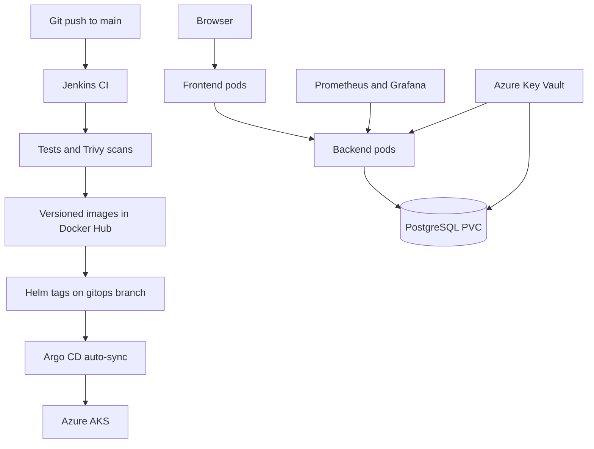

# AKS GitOps DevOps Challenge

A production-style demonstration stack with a static Nginx frontend, Python API,
and PostgreSQL dependency on Azure Kubernetes Service (AKS). Jenkins builds and
scans immutable images, publishes them to Docker Hub, and updates the image tags
in the Helm production values. Argo CD detects that Git change and deploys it to
AKS.

## Architecture



Jenkins never receives AKS credentials and never runs `kubectl apply`. Git is
the deployment boundary; Argo CD is the only continuous delivery controller.

## Included

- Secure multi-stage backend and frontend Dockerfiles.
- Non-root runtime users, dropped Linux capabilities, read-only application
  filesystems, resource requests/limits, and runtime-default seccomp.
- Immutable image version format: `MAJOR.MINOR.PATCH-bBUILD-SHORT_SHA`.
- Jenkins unit test, image build, Trivy source/image scan, Docker Hub push, Helm
  values update, and GitHub `gitops` branch push.
- Helm chart for two frontend pods, two backend pods, PostgreSQL StatefulSet,
  Azure Disk PVC, Services, PodDisruptionBudgets, and health probes.
- Azure Key Vault CSI integration with Microsoft Entra Workload Identity. The
  database password is not committed to Git.
- Argo CD automatic sync with pruning and retry.
- Prometheus Operator, Prometheus, Alertmanager, and Grafana installed by Helm.
- Backend `ServiceMonitor`, Prometheus alert rule, structured logs, and metrics.
- Repeatable database-DNS failure, diagnosis, reasoning, and recovery guide.

## Repository flow

| Branch | Owner | Purpose |
| --- | --- | --- |
| `main` | Developer | Application, Dockerfiles, pipeline, and chart source |
| `gitops` | Jenkins | Deployable chart plus exact production image tags |

The chart version tracks chart design changes. `Chart.yaml.appVersion` and both
image tags track each application release. Jenkins also pushes `latest` for
convenience, but Kubernetes always deploys the immutable release tag.

## 1. Push the project to GitHub

Create an empty GitHub repository, then run:

```bash
git init
git add .
git commit -m "Initial AKS GitOps challenge"
git branch -M main
git remote add origin https://github.com/YOUR_USER/devops-k8s-challenge.git
git push -u origin main

# Argo CD needs the branch before the first Jenkins release.
git push origin main:gitops
```

Use public Docker Hub repositories for the fastest demonstration. Private
images require an AKS image pull secret, which is intentionally outside this
90-minute challenge.

## 2. Configure and run Jenkins

Create these Jenkins username/password credentials:

| Credential ID | Username | Password |
| --- | --- | --- |
| `dockerhub-credentials` | Docker Hub username | Docker Hub access token |
| `github-gitops-credentials` | GitHub username | Fine-grained GitHub token with Contents read/write |

Create a Pipeline or Multibranch Pipeline from this repository. Configure the
job to build only `main`; do not build the `gitops` branch. The Jenkins agent
needs Git and Docker CLI access to a Docker daemon.

Set the build parameters:

- `DOCKERHUB_NAMESPACE`: your Docker Hub username or organization.
- `GITHUB_REPOSITORY`: `YOUR_USER/devops-k8s-challenge`.
- `GITOPS_BRANCH`: `gitops`.

Run the pipeline once. It publishes both exact images and commits the new tags
to `helm/devops-challenge/values-production.yaml` on `gitops`.

More detail: [docs/JENKINS_SETUP.md](docs/JENKINS_SETUP.md).

## 3. Provision AKS and Azure Key Vault

Prerequisites: Azure CLI, `kubectl`, Helm 3, OpenSSL, an Azure subscription, and
permission to create AKS, managed identities, role assignments, and Key Vault
secrets.

```bash
az login

export SUBSCRIPTION_ID="YOUR_AZURE_SUBSCRIPTION_ID"
export DB_PASSWORD="use-a-long-random-demo-password"

./scripts/provision-aks.sh
```

The script creates a two-node AKS cluster with OIDC, Workload Identity, and the
Key Vault CSI add-on; creates Key Vault and a user-assigned identity; assigns
`Key Vault Secrets User`; creates the federated credential; and stores the
database password in Key Vault. Non-secret IDs are written under `.generated/`.

More detail: [docs/AZURE_SETUP.md](docs/AZURE_SETUP.md).

## 4. Install monitoring, Argo CD, and the application

```bash
export GITHUB_REPO_URL="https://github.com/YOUR_USER/devops-k8s-challenge.git"
./scripts/bootstrap-aks.sh
```

The script uses Helm to install:

1. `kube-prometheus-stack` in `monitoring`.
2. Argo CD in `argocd`.
3. The bootstrap chart that creates the Argo CD project and application.

Argo CD reads `values-production.yaml` from `gitops`, renders the application
Helm chart, and deploys it to `devops-challenge`.

## 5. Verify the deployment

```bash
kubectl get applications.argoproj.io -n argocd
kubectl get deployments,statefulsets,pods,services,pvc -n devops-challenge
kubectl rollout status deployment/backend -n devops-challenge --timeout=180s
kubectl rollout status deployment/frontend -n devops-challenge --timeout=180s
./scripts/smoke-test.sh
```

Get the public frontend address:

```bash
kubectl get service frontend -n devops-challenge --watch
```

Open the `EXTERNAL-IP` after Azure assigns it.

## Prometheus, Grafana, and Argo CD

Keep these admin tools private and use local port-forwards for the demo:

```bash
kubectl port-forward service/monitoring-grafana -n monitoring 3000:80
kubectl port-forward service/monitoring-kube-prometheus-prometheus -n monitoring 9090:9090
kubectl port-forward service/argocd-server -n argocd 8081:80
```

Retrieve the generated Grafana password without printing it in deployment logs:

```bash
kubectl get secret grafana-admin -n monitoring \
  -o jsonpath='{.data.admin-password}' | base64 --decode
printf '\n'
```

In Prometheus, query `challenge_database_ready` and
`challenge_http_requests_total`. Grafana automatically receives Prometheus as a
data source through `kube-prometheus-stack`.

## Intentional failure demonstration

Argo CD auto-syncs Git changes, but `selfHeal` is intentionally disabled so a
manual live fault remains long enough to investigate during the recording.

```bash
./scripts/simulate-failure.sh
```

Use [docs/FAILURE_DEBUGGING.md](docs/FAILURE_DEBUGGING.md) to demonstrate the
symptoms, evidence, reasoning, root cause, and repair. Recover with:

```bash
./scripts/fix-failure.sh
./scripts/smoke-test.sh
```

## Reliability decision and tradeoff

Readiness is dependency-aware: it runs a real `SELECT 1` against PostgreSQL. A
new pod with a bad database hostname remains alive but never receives Service
traffic. Liveness only checks the API process, so a database outage does not
create a destructive restart loop. `maxUnavailable: 0` keeps old ready replicas
serving during a bad rollout.

The tradeoff is extra database traffic and tighter coupling between readiness
and the database. If all database connections fail, Kubernetes removes every
backend endpoint even though non-database routes could respond. In a larger
system, cache dependency state, use connection pooling, and decide explicitly
whether degraded read-only service is valuable.

## Production gaps kept honest

This is a strong 90-minute challenge, not a complete production platform.
PostgreSQL remains single-replica; Grafana and Prometheus data are ephemeral;
there is no TLS ingress, network policy, database backup/restore, HPA, multi-zone
database, image signing, policy admission, or environment promotion approval.
For production, prefer Azure Database for PostgreSQL, private AKS networking,
private endpoints for Key Vault, persistent monitoring storage, signed images,
policy enforcement, TLS ingress, and separate dev/stage/prod GitOps promotion.

Use [docs/VIDEO_SCRIPT.md](docs/VIDEO_SCRIPT.md) for the 8–12 minute recording.
